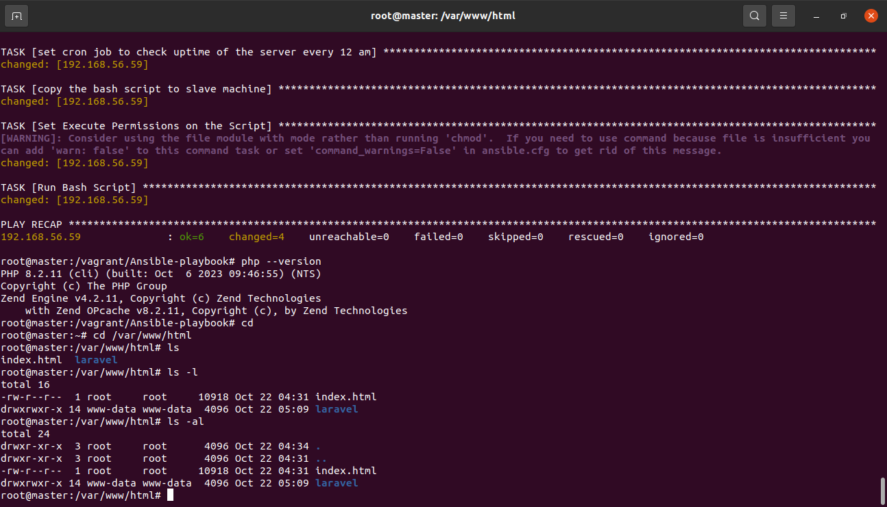

# Project Name 
  Cloud Engineering Second Semester Project :LAMP Stack Deployment
  
  ## Description
 1. The project will use vagrant to set up two ubuntu virtual machines Master and Slave
 
 2. Install LAMP(Linux,Apache,MYSQL ,PHP) stack on Master node using bash script automation.
 
 3. Laravel.sh script cloned the PHP applic ation from GitHub 
    install packages and also configure Apache webserver and MySQL\
 
 4. A reuseable and readable bash script
 
 5. Install Ansible playbook withbash script on the slave node 
    Verify PHP application Through the VM's Ip address
    Take screenshots as evidence
    Create a cron job to check the server's uptime every 12 am

  ## Prerequisites
 
 1. VirtualBox
 
 2. Vagrant 
 
 3. Ubuntu os
 
 4. Bash scripts(nodes.sh , laravel.sh )
 
 5. Ansible-playbook directory(ansible.cfg ,inventory , site.yaml 
    and a files directory containing the script laravel-slave.sh)
 
 6. LAMP installation

 ## Deployment steps
 
 1.  The Script node.sh created :
     
      - A vagrantfile and the two master and slave nodes
  
 2.  laravel.sh script run :
 
      - updating and upgrading of the server 
    
      - Installation of LAMP ,Composer Installation ,Configuration of Apache2 ,
        
        Clone laravel application and dependencies

      - MYSQL Configuration ( creating user and password).

      - PHP execution key generation and migration command

      - With chmod +x laravel.sh permission the script(./laravel.sh) run on 
        
        master and slave nodes 
 
 3.  Ansible-playbook :

      - This Ansible-playbook run on a bash script (laravel-slave.sh)

      - With automation instruction given to the master node to 
        
        run the script in the slave node as stated in the project description

        with chmod +x laravel-slave.sh permission;

      - An ansible directory consist of :

      - ansibble.cfg :
           
           Set as default ,with Inventory set to inventory ,
           
           a private key with no host key checking

      -  inventory  :

           House the slave node ip address - 192.168.56.59   
          
      -  site.yaml  : 
           
           Host all the tasks with become(sudo priviledge) ,it upgrade and update the server,

      -   cron job task ,copy the bash script to the slave node roots(user and group)

      -   Execute permission(chmod +x laravel-slave.sh) 
          
      -   as well as run the script(./laravel-slave.sh)
      
 4.  files :

      - this is the directory location for the bash script laravel-slave.sh

      

      

      

      

      

     

      ## Contact

      tajudeenadedejir2@gmail.com

      ## Acknowledgments
      
      Instructors and Colleagues at AltSchool Africa
      
      https://www.google.com/
      
      https://www.w3schools.com/
      
      https://git.drupalcode.org/project/gin/-/blob/8.x-3.x/README.md

      https://www.seancdavis.com/posts/three-ways-to-add-image-to-github-readme/

      https://askubuntu.com/questions/85627/how-to-display-a-picture-in-html

      https://chat.openai.com/c/609b499f-1d33-49a1-b555-94a148ee7fe0

      https://dev.to/sureshramani/how-to-deploy-laravel-project-with-apache-on-ubuntu-36p3
      https://docs.ansible.com/

      

